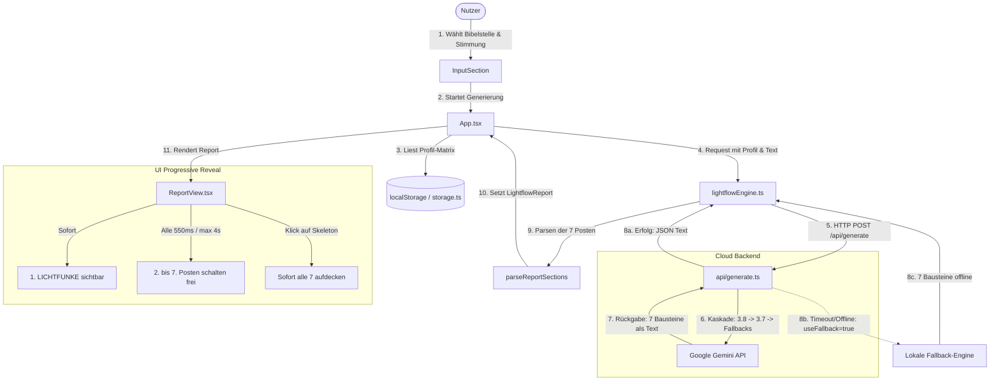

# PROJECT_HANDOVER.md
**Lightflow – Angeschlossen an die Quelle**  
*Umfassende Architektur- und Projektdokumentation für den externen Chef-Architekten (AI)*  
*Stand: Oktober 2026 | Version: v1.3.2*

---

## 1. Projektziel & Vision

### 1.1 Was macht die App genau?
**Lightflow** ist eine responsive, client-first Web-Applikation (PWA), die biblische Texte und persönliche Lebensrealität miteinander verknüpft. 
Wenn ein Nutzer eine Bibelstelle oder ein Kapitel aufschlägt, analysiert die KI den Text nicht abstrakt, historisierend oder dogmatisch, sondern generiert einen maßgeschneiderten, **7-stufigen Auslegungs-Report**. 

Dieser Report wird durch eine individuelle **Nutzer-Matrix** formatiert:
- **Beruf & Praxisalltag** (z. B. Handwerk / Küchenmonteur für anspruchsvolle Endmontage mit konkreten Werkzeugen und Situationen)
- **Denkstil & Stärken** (z. B. lösungsorientiert/analytisch, bildhaft, beziehungsorientiert)
- **Lebenssituation & Zivilstand** (z. B. single/alleinlebend, Partnerschaft, Familie)
- **Weg mit Jesus** (z. B. Zweifel & Suche, Neugierig, Tiefe Beziehung, Erschöpft)
- **Tagesverfassung / Gemütslage** (z. B. unter Druck/erschöpft, suche Klarheit, dankbar)

### 1.2 Zielgruppe
Einzelne Gläubige, Zweifelnde, Suchende und Berufstätige, die ihren christlichen Glauben authentisch im Alltag verankern wollen.

> [!IMPORTANT]
> **Strikte Domänen-Trennung:** Lightflow ist eine persönliche App für das geistliche Wachstum des Einzelnen. Sie enthält **keinerlei** Baustellen-Management, keine Vorarbeiter-/Chef-Hierarchien und keine Rapportierungs-Funktionen (keine Vermischung mit der B2B-Handwerker-App *Rapporto*!).

### 1.3 Welches Problem löst die App?
1. **Verständnis & Erzählfluss:** Viele Menschen empfinden biblische Texte als trocken, schwer verständlich oder moralisierend. Lightflow arbeitet den historischen Kontext, den menschlichen Fehlschluss und die befreiende Kernaussage in vollständigen, tiefgründigen Sätzen heraus.
2. **Transfer in die Realität:** Es gibt keine frommen Floskeln. Die Auslegung nutzt die Fachbegriffe und typischen Herausforderungen des Berufsalltags des Nutzers als lebendige Metaphern.
3. **Entlastung von Leistungsdruck:** Im Fokus steht das Gnadenprinzip – Gott fordert keine Vorleistung, sondern schenkt Ruhe, besonders im Feierabend.

---

## 2. Tech-Stack & Frameworks

| Schicht | Technologie | Details / Version |
| :--- | :--- | :--- |
| **Frontend Runtime** | React 19 | `react@^19.0.0`, `react-dom@^19.0.0` |
| **Sprache** | TypeScript | `typescript@~5.7.2` mit strikter Typisierung |
| **Build-Tool** | Vite 6 | `vite@^6.2.0`, `@vitejs/plugin-react@^4.3.4` |
| **Styling** | Tailwind CSS v4 | `@tailwindcss/vite@^4.0.0`, `@tailwindcss/vite` |
| **Icons** | Lucide React | `lucide-react@^1.16.0` |
| **Audio / Speech** | Web Speech API | Native Browser-Sprachsynthese (`speechSynthesis`) für das Vorlesen |
| **Serverless Backend** | Vercel Serverless Functions | `api/generate.ts` via `@vercel/node@^20.0.0` (Node.js 20) |
| **KI-Engine (Cloud)** | Google Gemini API | Priorität: Gemini 3.8 / 3.7 mit automatischer Kaskade auf Gemini 2.5/Flash |
| **KI-Engine (Offline)** | Lokale Fallback-Engine | Integrierte Heuristik-Engine in `src/services/lightflowEngine.ts` (0% Fehlergarantie) |
| **Datenspeicherung** | LocalStorage (Client-First) | Vollständige Offline-Fähigkeit ohne Zwang zu Cloud-Accounts |
| **Datenbank (Optional)**| Supabase | `@supabase/supabase-js@^2.117.2` (vorbereitet, aktuell Local-First aktiv) |
| **Hosting & CI/CD** | Vercel & GitHub | Live-URL: `https://lightflow-app-two.vercel.app` |

---

## 3. Architektur & Dateistruktur

### 3.1 Verzeichnisbaum
```text
bold-bohr/
├── api/
│   └── generate.ts              # Vercel Serverless API-Endpunkt (Gemini-Anbindung & Kaskade)
├── dist/                        # Production Build Artefakte
├── public/                      # PWA-Assets, Manifest, Icons
├── src/
│   ├── components/
│   │   ├── BiblePickerModal.tsx # Bibelstellen-Auswahl & Schnellfinder nach Themen
│   │   ├── Header.tsx           # Kopfzeile mit Status, Profil-Button, Theme-Switch
│   │   ├── InputSection.tsx     # Bibelstellen-Eingabe, Stimmungs-Filter & CTA-Button
│   │   ├── ProfileModal.tsx     # Profilverwaltung mit Grobauswahl & Freitextfeld
│   │   ├── ReportView.tsx       # 7-Posten-Visualisierung, progressive Enthüllung, Copy & Audio
│   │   ├── SavedReportsModal.tsx# Archiv gespeicherter & favorisierter Auslegungen
│   │   └── SettingsModal.tsx    # App-Einstellungen (Theme, API-Provider, Version v1.3.2)
│   ├── data/
│   │   └── bibleData.ts         # Bibelbuch-Verzeichnis, Kapitelanzahlen, Empfehlungen
│   ├── services/
│   │   ├── lightflowEngine.ts   # System-Prompt, Parser, Cloud-Aufruf & Offline-Engine
│   │   ├── storage.ts           # LocalStorage-Persistenz für Profile, Reports & Settings
│   │   └── supabase.ts          # Optionaler Supabase-Client (sofern ENV hinterlegt)
│   ├── types/
│   │   └── index.ts             # TypeScript Interfaces (UserProfile, LightflowReport, etc.)
│   ├── App.tsx                  # Hauptkomponente, State-Orchestrierung & Modals
│   ├── index.css                # Globale Styles & Farbvariablen (Tailwind v4)
│   ├── main.tsx                 # React App Entry Point
│   └── vite-env.d.ts            # Vite Umgebungstypen
├── package.json                 # v1.3.2, Scripts & Dependencies
├── tsconfig.json                # TypeScript Konfiguration
├── vercel.json                  # Vercel Rewrites & Serverless Function Settings
└── vite.config.ts               # Vite Plugin Konfiguration
```

### 3.2 Datenfluss (Architekturdiagramm)



### 3.3 Das 7-Posten-Modell im Detail
Jede Auslegung wird strikt in 7 standardisierte Blöcke gegliedert:
1. **LICHTFUNKE:** Persönlicher, direkter Zuspruch von Jesus auf Augenhöhe (ohne Floskeln).
2. **KLARBLICK:** Historische und narrative Erklärung, menschlicher Irrtum, Warnung und Kernaussage, abgestimmt auf den Denkstil.
3. **TAGWERK:** 1:1-Übertragung in die reale Arbeitswelt (Werkzeuge, Handgriffe, Kollegium) inklusive konkreter Handlungsempfehlung.
4. **FREIRAUM:** Feierabend, Loslassen von To-Do-Listen und Entlastung von Leistungsdruck ohne schlechtes Gewissen.
5. **STANDPUNKT:** Reale Lebenssituation (Single, Familie, Partnerschaft) und gesunde Grenzen im Miteinander.
6. **SPIEGEL:** Gemeinschaft & Miteinander plus genau 2–3 ehrliche Reflexionsfragen für die persönliche Stille.
7. **LEUCHTKRAFT:** Der Garten im Herzen – ein Raum des Aufatmens mit einem vollständig ausformulierten Herzensgebet.

---

## 4. Bestehende Regeln & Vorgaben

### 4.1 Die 3 festen Team-Rollen
- **Thomas (Lead Developer / Vibe-Architect):** Höflich, klar strukturiert, vorausschauend, liefert am Ende immer einen Vorschlag für den nächsten Schritt.
- **René (Security & QA):** Prüft vor jedem Commit API-Sicherheit, Key-Leaks, Typsicherheit, Race Conditions und Failover.
- **Jimmy (Endnutzer-Tester):** Jimmy ist der reale App-Nutzer. Er sieht nur das Frontend. Für jedes Release schlüpft Jimmy in eine zufällige Persona (z. B. *Klassenlehrer einer 5. Primarschulklasse, ledig, tiefe Beziehung zu Gott, bildhafter Denkstil*) und testet die App im Browser, bevor er sein Fazit abgibt.

### 4.2 Das obligatorische Statusberichts-Format
Jeder Bericht nach Änderungen muss zwingend folgende Reihenfolge einhalten:
1. **Version**
2. **Geänderte Dateien**
3. **Renes Sicherheits-Check**
4. **Jimmys Fazit** (aus Sicht der Test-Persona)
5. **Hinterlegtes KI-Modell**
6. **GitHub-Status**
7. **Supabase-Status**
8. **Vercel-Status**
9. **Letzter Satz:** Vorschlag von Thomas für den nächsten Schritt.

### 4.3 Leitlinien für Prompt & Textgenerierung
1. **Keine abgehackten Sätze:** Jeder Gedanke muss in vollständigen, grammatikalisch geschlossenen, flüssigen Sätzen formuliert werden. Kein Abbruch mitten im Text.
2. **100% Textbezug & Verständnis:** Die narrative Handlung und theologische Warnung des Textes müssen glasklar vermittelt werden.
3. **Kein Meta-Talk:** Die KI darf niemals sagen „Weil du Küchenmonteur bist...“ oder „Da du Single bist...“. Das Profil muss als unsichtbarer Maßanzug wirken.
4. **Freitext-Integration:** Das Freitextfeld `professionDetail` (z. B. „Küchenmonteur für anspruchsvolle Endmontage & Passleisten“) muss im Backend voll ausgeschöpft werden, um authentische Arbeitsbegriffe einzubinden.

### 4.4 Git & Repository-Konventionen
- **Author:** `radomil27 <330086597+radomil27@users.noreply.github.com>`
- **Dual-Remote Push:** Jeder Commit muss immer auf beide Remotes gepusht werden:
  `git push app main && git push origin main`
  - `origin`: `https://github.com/radomil27/lightflow.git`
  - `app`: `https://github.com/radomil27/lightflow-app.git`

---

## 5. Aktueller Status

### 5.1 Fertiggestellt (Live in v1.3.2)
- [x] **7-Posten-Auslegungs-Architektur:** Vollständige Umstellung von der alten 6-Stufen-Logik auf die neuen 7 Bausteine.
- [x] **Profil mit Freitext:** Grobauswahl kombiniert mit freiem Berufsalltags-Feld (`professionDetail`).
- [x] **Progressive Enthüllung (Variante A):** Posten 1 erscheint sofort; Posten 2 bis 7 schalten sich im 550ms-Takt mit animierten Lade-Skeletten frei.
- [x] **Re-Render-resistenter Timer:** Umstellung auf `useRef`-Tracking und automatischer 4-Sekunden-Notanker gegen eingefrorene Ladebalken.
- [x] **Klick-zum-Sofortaufdecken:** Direkter Klick auf ein beliebiges Lade-Skelett schaltet alle 7 Posten sofort frei.
- [x] **Individuelle Kopierbuttons:** Jeder einzelne Baustein besitzt einen eigenen Kopier-Button mit 2s-Häkchen-Feedback.
- [x] **Persistenz & Archiv:** Speichern von Favoriten, persönlichen Notizen und lokaler Verlauf im LocalStorage.
- [x] **Integrierte Vorlesefunktion (TTS):** Sprachausgabe via Web Speech API mit Stop/Start-Steuerung.
- [x] **Gemini 3.8/3.7 Kaskade:** Vercel-Serverless-Funktion mit Priorität auf Gemini 3.8/3.7 und 0%-Fehler-Ausfallsicherung.

### 5.2 In Arbeit / Nächste Schritte
- [ ] **Echtes Token-Streaming (SSE):** Streaming der Tokens via Server-Sent Events direkt aus der Vercel Function für noch kürzere wahrgenommene Ladezeit.
- [ ] **Tagesstimmungs-Verzahnung:** Direktere Einfärbung des Einstiegs-Zuspruchs (Posten 1) anhand der 8 wählbaren Stimmungen (z. B. „Erschöpft“, „Unter Druck“, „Dankbar“).

### 5.3 Geplantes Backlog
- [ ] Schnell-Teilen-Funktion für WhatsApp / Telegram (Einzelauszug für Kollegen).
- [ ] Bibelstellen-Volltext-Viewer direkt in der App via freier Bibel-API.
- [ ] Optionale Supabase-Cloud-Synchronisation über mehrere Geräte hinweg.

---

## 6. Aktuelle Knackpunkte & Technische Herausforderungen

### 6.1 Vercel Free Serverless Timeout (10 Sekunden)
- **Problem:** Auf Vercel Hobby/Free beträgt das harte Ausführungslimit für Serverless Functions **10 Sekunden** (die Option `maxDuration: 60` in `vercel.json` wird nur mit Vercel Pro wirksam). Wenn Google Gemini bei hohem weltweitem Traffic für 4096 Tokens länger als 10 Sekunden braucht, beendet Vercel den Request mit `FUNCTION_INVOCATION_TIMEOUT`.
- **Aktuelle Lösung:**
  1. `maxOutputTokens` wurde auf ca. 2000–2500 optimiert, wodurch die Generierung in der Regel in 3–4 Sekunden abgeschlossen ist.
  2. Falls die Cloud-Generierung 6 Sekunden überschreitet oder Google einen 503-Engpass meldet, gibt das Backend `{ useFallback: true }` zurück. Die App schaltet sofort und geräuschlos auf die lokale Exegese-Engine um – der Nutzer sieht **niemals** eine Fehlermeldung.
  3. `api/generate.ts` unterstützt nun zusätzlich einen optionalen Parameter `posten: 1..7`, sodass jeder Baustein bei Bedarf einzeln in unter 1 Sekunde generiert werden kann.

### 6.2 Namenskonventionen der Google Gemini API
- **Problem:** Die Modellnamen variieren zwischen Google API Versionen (`v1beta` vs `v1`). Zukünftige Modelle wie `gemini-3.8` oder `gemini-3.7` liefern derzeit auf der öffentlichen Google-API einen HTTP 404 zurück, da sie noch nicht für jeden Consumer freigeschaltet sind.
- **Lösung:** Eine geordnete Kaskade prüft zuerst 3.8 und 3.7. Schlägt der Aufruf fehl, springt der Code sofort in den nächsten stabilen Endpunkt (`gemini-2.5-flash`, `gemini-2.0-flash`, `gemini-flash-latest`), ohne dass der Client blockiert wird.

### 6.3 Browser-Throttling & React Re-Renders
- **Problem:** In React 19 führen State-Updates im übergeordneten Container (`App.tsx`) zum Neu-Rendern untergeordneter Komponenten. Reine `setTimeout`-Arrays in `useEffect` wurden dadurch vorzeitig gelöscht, wodurch Lade-Skelette einfroren.
- **Lösung:** Verwendung einer `useRef`-gesicherten Ausführung (`activeReportIdRef`), die Entriegelung per `setInterval` und ein 4-Sekunden-Notanker sorgen für garantierte Enthüllung.

---
*Dokumentation verfasst von Thomas für den externen Chef-Architekten.*
